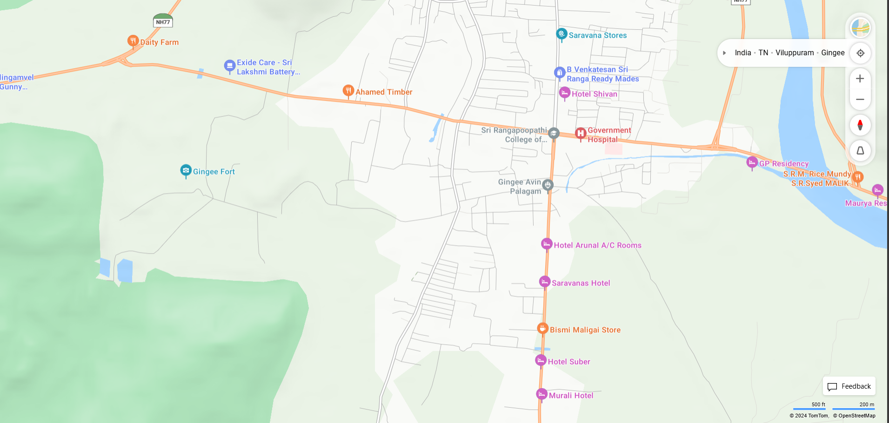

# Ex04 Places Around Me
## Date: 15.12.2024

## AIM
To develop a website to display details about the places around my house.

## DESIGN STEPS

### STEP 1
Create a Django admin interface.

### STEP 2
Download your city map from Google.

### STEP 3
Using ```<map>``` tag name the map.

### STEP 4
Create clickable regions in the image using ```<area>``` tag.

### STEP 5
Write HTML programs for all the regions identified.

### STEP 6
Execute the programs and publish them.

## CODE
```
map.html
<html>
    <head>
        <title>MY CITY</title>
    </head>
    <body>
        <h1 align="center">
            <font color="blue"><b>GINGEE</b></font>
        </h1>
        <h1 align="center"><b>jayaharshini .S (24900459)</b></h1>
        <p>Gingee, also known as Senji, is a town in Tamil Nadu, India. It is famous for its historical Gingee Fort, which was considered the "Troy of the East" by the British. The town is surrounded by rocky hills and fortifications, making it a significant tourist destination. Gingee has a rich history dating back to the Chola dynasty and has been ruled by various empires such as the Vijayanagar Empire, Marathas, Mughals, and British.</p>
        
        <map name="test">
            <area shape="rect" alt="Dummy" coords="50,0,300,250" href="home.html" target="home town">
            <area shape="rect" alt="Dummy" coords="644,400,733,430" href="temple" target="balamurugan temple">
            <area shape="rect" alt="Dummy" coords="634,430,700,536" href="lake.html" target="anathur lake">
            <area shape="rect" alt="Dummy" coords="741,300,850,380" href="garden.html" target="RR Garden">
            <area shape="rect" alt="Dummy" coords="620,200,720,250" href="stone.html" target="virpattu big stone">
        </map>
    </body>
</html>

lake.html
<!DOCTYPE html>
<html lang="en">
<head>
    <meta charset="UTF-8">
    <meta name="viewport" content="width=device-width, initial-scale=1.0">
    <title>Anathur Lake</title>
    <style>
        body {
            margin: 0;
            padding: 0;
            font-family: Arial, sans-serif;
        }
        h2 {
            text-align: center;
            background-color: lightgreen;
            margin: 0;
            padding: 1.5rem;
        }
        p {
            margin: 20px;
            line-height: 1.6;
        }
        .image-container {
            text-align: center;
            margin: 20px 0;
        }
        img {
            max-width: 100%;
            height: auto;
            border: 2px solid #ccc;
            border-radius: 5px;
        }
    </style>
</head>
<body>
    <h2>Welcome to Anathur Lake</h2>
    <div class="image-container">
        
    </div>
    <p>Anathur Lake, located near Gingee in Tamil Nadu, is a stunning natural reservoir surrounded by lush greenery. The lake serves as a vital water source for the region and is a serene spot for nature enthusiasts and travelers. Its tranquil waters and picturesque environment make it a popular destination for picnics and relaxation.</p>
    <p>The lake is also home to diverse flora and fauna, offering a peaceful escape from the hustle of daily life. Visitors can enjoy the scenic beauty, bird-watching opportunities, and cool breezes around the lake.</p>
</body>
</html>

garden.html
<!DOCTYPE html>
<html lang="en">
<head>
    <meta charset="UTF-8">
    <meta name="viewport" content="width=device-width, initial-scale=1.0">
    <title>RR Garden</title>
    <style>
        body {
            margin: 0;
            padding: 0;
            font-family: Arial, sans-serif;
        }
        h2 {
            text-align: center;
            background-color: lightpink;
            margin: 0;
            padding: 1.5rem;
        }
        p {
            margin: 20px;
            line-height: 1.6;
        }
        .image-container {
            text-align: center;
            margin: 20px 0;
        }
        img {
            max-width: 100%;
            height: auto;
            border: 2px solid #ccc;
            border-radius: 5px;
        }
    </style>
</head>
<body>
    <h2>Welcome to RR Garden</h2>
    <div class="image-container">
        
    </div>
    <p>RR Garden, located in Gingee, Tamil Nadu, is a beautifully landscaped garden and a popular spot for leisure and recreation. The garden features vibrant flower beds, lush lawns, and shaded pathways, making it an ideal destination for families and nature enthusiasts.</p>
    <p>The garden is also equipped with facilities like seating areas, a small play area for children, and open spaces for events or gatherings. The peaceful ambiance and colorful surroundings make RR Garden a perfect place to unwind and connect with nature.</p>
</body>
</html>

temple.html
<!DOCTYPE html>
<html lang="en">
<head>
    <meta charset="UTF-8">
    <meta name="viewport" content="width=device-width, initial-scale=1.0">
    <title>Balamurugan Temple</title>
    <style>
        body {
            margin: 0;
            padding: 0;
            font-family: Arial, sans-serif;
        }
        h2 {
            text-align: center;
            background-color: lightblue;
            margin: 0;
            padding: 1.5rem;
        }
        p {
            margin: 20px;
            line-height: 1.6;
        }
        .image-container {
            text-align: center;
            margin: 20px 0;
        }
        img {
            max-width: 100%;
            height: auto;
            border: 2px solid #ccc;
            border-radius: 5px;
        }
    </style>
</head>
<body>
    <h2>Welcome to Balamurugan Temple</h2>
    <div class="image-container">
        
    </div>
    <p>The Balamurugan Temple, located in Gingee, Tamil Nadu, is a revered place of worship dedicated to Lord Murugan. This temple is situated on a picturesque hilltop, offering stunning views of the surrounding landscape. The serene ambiance and spiritual significance make it a popular destination for devotees and tourists alike.</p>
    <p>The temple is known for its intricate carvings, vibrant festivals, and rituals. Pilgrims often visit to seek blessings, especially during Thaipusam and other auspicious occasions. The temple reflects the rich cultural and religious heritage of Tamil Nadu.</p>
</body>
</html>

stone.html
<!DOCTYPE html>
<html lang="en">
<head>
    <meta charset="UTF-8">
    <meta name="viewport" content="width=device-width, initial-scale=1.0">
    <title>Virpattu Big Stone</title>
    <style>
        body {
            margin: 0;
            padding: 0;
            font-family: Arial, sans-serif;
        }
        h2 {
            text-align: center;
            background-color: lightgray;
            margin: 0;
            padding: 1.5rem;
        }
        p {
            margin: 20px;
            line-height: 1.6;
        }
        .image-container {
            text-align: center;
            margin: 20px 0;
        }
        img {
            max-width: 100%;
            height: auto;
            border: 2px solid #ccc;
            border-radius: 5px;
        }
    </style>
</head>
<body>
    <h2>Welcome to Virpattu Big Stone</h2>
    <div class="image-container">
        
    </div>
    <p>The Virpattu Big Stone, located near Gingee in Tamil Nadu, is a remarkable natural rock formation that attracts visitors for its sheer size and unique appearance. It stands as a testament to the geological history of the region and is a popular spot for photography and exploration.</p>
    <p>Surrounded by scenic beauty, the stone serves as a landmark and is often visited by locals and tourists seeking to experience its natural grandeur. It’s also a great spot for those interested in geology and nature walks.</p>
</body>
</html>

NH77 Daity Farm
<!DOCTYPE html>
<html lang="en">
<head>
    <meta charset="UTF-8">
    <meta name="viewport" content="width=device-width, initial-scale=1.0">
    <title>NH77 Dairy Farm</title>
    <style>
        body {
            margin: 0;
            padding: 0;
            font-family: Arial, sans-serif;
        }
        header {
            background-color: #32a852;
            color: white;
            text-align: center;
            padding: 2rem;
        }
        section {
            margin: 20px;
            text-align: center;
        }
        section img {
            max-width: 100%;
            height: auto;
            border-radius: 10px;
        }
        p {
            font-size: 1.2rem;
            line-height: 1.6;
            margin: 20px;
            color: #555;
        }
        footer {
            background-color: #32a852;
            color: white;
            text-align: center;
            padding: 10px 0;
            position: fixed;
            bottom: 0;
            width: 100%;
        }
    </style>
</head>
<body>
    <header>
        <h1>NH77 Dairy Farm</h1>
    </header>

    <section>
        
        <p>Located along the bustling NH77 highway, the NH77 Dairy Farm is a serene oasis of agricultural excellence and natural beauty. Known for its high-quality milk production and sustainable farming practices, the farm has become a landmark in the region.</p>
        <p>The dairy farm is surrounded by lush greenery and offers visitors a chance to witness modern dairy farming processes. It’s not just a farm—it’s a place where nature and innovation come together to produce some of the finest dairy products in the region.</p>
    </section>

    <footer>
        <p>&copy; 2024 NH77 Dairy Farm. All Rights Reserved.</p>
    </footer>
</body>
</html>
home.html
<!DOCTYPE html>
<html lang="en">
<head>
    <meta charset="UTF-8">
    <meta name="viewport" content="width=device-width, initial-scale=1.0">
    <title>Welcome to My Hometown</title>
    <style>
        body {
            margin: 0;
            padding: 0;
            font-family: Arial, sans-serif;
        }
        header {
            background-color: #1E90FF;
            color: white;
            text-align: center;
            padding: 2rem;
        }
        nav {
            background-color: #f4f4f4;
            padding: 10px 0;
            text-align: center;
        }
        nav a {
            text-decoration: none;
            color: #1E90FF;
            font-weight: bold;
            margin: 0 20px;
            padding: 8px 15px;
            border: 2px solid #1E90FF;
            border-radius: 5px;
            transition: all 0.3s ease;
        }
        nav a:hover {
            background-color: #1E90FF;
            color: white;
        }
        section {
            text-align: center;
            margin: 20px;
            padding: 20px;
        }
        section img {
            max-width: 100%;
            height: auto;
            border-radius: 10px;
        }
        footer {
            background-color: #1E90FF;
            color: white;
            text-align: center;
            padding: 10px 0;
            position: fixed;
            bottom: 0;
            width: 100%;
        }
    </style>
</head>
<body>
    <header>
        <h1>Welcome to My Hometown</h1>
        <p>Explore the charm and beauty of Gingee</p>
    </header>

    <nav>
        <a href="1.html">Balamurugan Temple</a>
        <a href="2.html">Anathur Lake</a>
        <a href="3.html">RR Garden</a>
        <a href="4.html">Virpattu Big Stone</a>
    </nav>

    <section>
        <h2>About Gingee</h2>
        
        <p>Gingee, a town in Tamil Nadu, is steeped in history and natural beauty. Famous for its *Gingee Fort*, the town is often referred to as the "Troy of the East." From its ancient temples to scenic lakes and gardens, Gingee offers a unique blend of culture and nature.</p>
        <p>Discover the iconic landmarks and hidden gems that make Gingee a special place. Navigate through the links above to explore more!</p>
    </section>

    <footer>
        <p>&copy; 2024 My Hometown, Gingee. All Rights Reserved.</p>
    </footer>
</body>
</html>
```

## Output



## RESULT
The program for implementing image maps using HTML is executed successfully.
